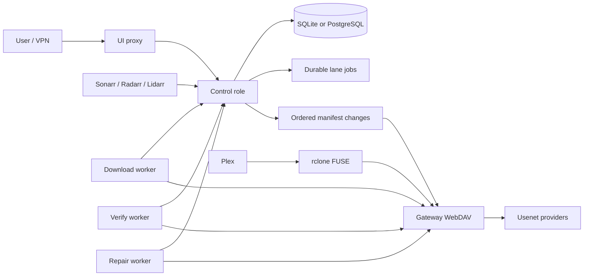

# NZBDav Full Engineering Handoff

| Field | Value |
| --- | --- |
| Generated | 2026-07-11 |
| Repository | `nzbdav` personal fork |
| Workspace | `/Users/binghzal/Developer/nzbdav` |
| Production host | `10.10.5.119` |
| Production media-stack checkout | `/opt/media-stack` |
| Current local branch | `codex/single-host-role-separation-design` |
| Last clean implementation checkpoint | `d7395a5` (`fix: preserve container maintenance contract`) |
| Current `main` | `86af7b81` (`docs: record first-byte remediation`) |
| Remote tracking | `main` tracks `origin/main`; the current architecture branch is local and not pushed |

## 0. 2026-07-11 Continuation Addendum

This addendum is the authoritative continuation state. It supersedes Sections
2, 7, 8, 9.1, 9.2, 15, 17, and 20 wherever their interrupted-Task-5 status,
commit ledger, test matrix, or combined-Task-6 sequence conflicts with the
verified results below. The historical sections remain intact as evidence of
what was inherited and why the repair was narrowed.

### 0.1 Verified Current State

| Area | Current result | Evidence |
| --- | --- | --- |
| Foundation Task 5 second-review repair | Complete and committed | `dd153c0a` isolates test state; `986a29a2` completes history/receipt atomicity |
| Task 5 focused SQLite gate | 60 passed, 0 failed | `.superpowers/sdd/foundation-task-5-report.md` |
| Task 5 focused live PostgreSQL gate | 4 passed, 0 failed | Receipt concurrency plus isolated native-schema savepoint coverage |
| Required complete backend gate | 694 passed, 0 failed, 0 skipped in one testhost with PostgreSQL enabled | Disposable PostgreSQL 16 container; removed after the run |
| Cross-process test isolation | Reproduced and fixed | Two old-path testhosts failed independently; two unique-root testhosts passed; no fixture roots remained |
| Root container maintenance contract | Complete and committed | `d7395a5`; shell contract and rebuilt-image smoke passed |
| Current branch relation to `main` | 26 commits ahead, 0 behind at this checkpoint | `main` and `origin/main` both `86af7b81` |
| Remote architecture branch / PR | None found | `git ls-remote` found no branch and `gh pr list` returned `[]` for this head on 2026-07-11 |
| Production deployment | Not performed or independently verified in this continuation | No deployment claim |

The entrypoint repair makes Docker arguments reach an explicit maintenance
allowlist, rejects option-looking transfer paths, applies `umask 077`, preserves
the first child exit status, and keeps normal automatic migration plus
backend/frontend startup intact. Real-image tests covered migration, export,
mode `0600`, arbitrary-command rejection, health, TERM shutdown, and cleanup.

### 0.2 Verified Blockers And Sanity Findings

1. **PostgreSQL physical-schema compatibility is a release blocker.** The
   shared migration history was scaffolded with SQLite store types. A fresh
   PostgreSQL 16 migration leaves at least 28 identifier-like columns as `text`
   while the current model and newer tables use UUIDs. A history predicate
   reproduces PostgreSQL `42883` (`text = uuid`), and a seeded export fails
   reading `text` as `Guid`. Date, boolean, and integer mismatches remain too.
   The 694-test gate does not prove migrated history CRUD because that focused
   savepoint test intentionally uses `EnsureCreated` in an isolated schema.
2. **The SQLite-to-PostgreSQL helper is not yet a safe executable migration.**
   The former Docker invocation treated maintenance flags as the container
   executable; that transport bug is fixed by `d7395a5`. Snapshot security,
   explicit Docker networking, immutable image selection, canonical content
   verification, redacted manifests, retention, and real transfer smoke remain
   planned in
   `docs/superpowers/plans/2026-07-11-nzbdav-runtime-migration-safety.md`.
   The reviewed plan now also forbids mounting **or opening** the rollback
   SQLite source through SQLite. It first byte-copies the stopped database and
   exact existing WAL/SHM set, proves the source fingerprint is unchanged, and
   normalizes only that private raw copy into a verified WAL-correct backup. It
   also requires an explicit non-root migration identity for the mode-`0700`
   tree, a separate private PostgreSQL maintenance config so the real target
   config cannot be container-chowned, final source/database/blob stability
   checks, ownership-proven named-container/atomic-temp cleanup, explicit
   forced-recovery state if cleanup misses its deadline, and immediate runbook
   secret cleanup. Its default executable path is restricted
   to an empty, offline, disposable PostgreSQL target; any failed target mutation
   taints that target until drop/recreate/schema-reset. Do not implement or
   advertise the real transfer until the PostgreSQL schema decision below is
   resolved.
3. **The public proxy does not yet match the allowlist decision in Section
   3.7.** Current frontend proxy behavior broadly exposes `/api` and WebDAV
   roots/methods. Treat explicit route/method allowlisting as a pre-release
   security task, not optional hardening.
4. **Mount fail-closed behavior is overstated in current documentation.** A
   Docker health status and Compose startup dependency do not automatically
   stop a running consumer when the mount degrades. The deployment design needs
   an explicit watchdog and pause/unmount/recreate/verify/resume procedure.
5. **The safe-rclone updater persists too much state.** Its state file can retain
   rendered Compose configuration and secret material with ordinary file
   permissions. Replace it with an atomic mode-`0600` digest/minimal-state
   record before relying on it as a security boundary.
6. **Release gates are incomplete.** The current workflows do not run the Python
   suite or a PostgreSQL-backed complete backend gate, and their clean-diff check
   is not a PR-range validation. Node versions also differ across CI, frontend
   build, runtime, and type packages. These are Foundation Task 8/release
   blockers.
7. **Repository metadata is not fully clean.** `.git/refs/.DS_Store` is an
   invalid ref and makes `git fsck --full` exit 8. Finder `.DS_Store` files and
   an unrelated untracked `artifacts/` directory were deliberately not staged,
   deleted, or claimed as evidence. Remove or quarantine them only as an
   explicit cleanup action.
8. **The Product Design audit is not complete.** The in-app Browser reached the
   existing `/health` and `/queue` flows, but the local mock remained in a
   permanent `Usenet Connections Loading...` state because it accepted the
   websocket subscription without returning connection state. Loading-state
   screenshots were rejected as audit evidence. Use a stable fixture or live
   target before making visual conclusions.

### 0.3 Architecture Contract Corrections Before Task 6

- Section 3.8 already resolves credential ownership: provider credentials are
  gateway-only secrets; control stores non-secret metadata. Amend any plan text
  that has control loading provider secrets or building credential-bearing
  gateway snapshots.
- Split Foundation Task 6 into **6A manifest durability** and **6B ARR command
  outbox**. Do not combine them into one review surface.
- PostgreSQL sequences are not gapless because `nextval` is not rolled back.
  Do not require strictly contiguous replay from a plain sequence; design an
  explicitly locked transactional sequence state or a gap-tolerant protocol.
- Define manifest coverage for completed-symlink receipt visibility, tombstones,
  queue/config-derived `/nzbs`, and upload/cancel/delete semantics.
- Replace an unbounded unary whole-tree snapshot with a framed/streaming snapshot
  carrying a consistent high-water mark, count, and content digest.
- ARR outbox execution needs owner/token/generation or equivalent lease fencing
  so stale `Executing` rows can be recovered safely.
- Use role-scoped authentication and server time; a shared token, caller time,
  or unauthenticated `worker_id` is not an ownership protocol.
- Rollback must stop split roles before starting `all`, and must account for
  image/schema compatibility. Role heartbeats should include immutable image and
  protocol versions. Aggregate performance baselines must include the Node UI
  process used by the monolith.

### 0.4 Revised Immediate Sequence

1. Obtain the two PostgreSQL decisions in Section 0.5.
2. Author and independently review a dedicated provider-migration design,
   rehearsal, validation, and rollback plan. It must inventory every mismatched
   column/index/trigger, invalid/colliding UUID behavior, timestamp conversion,
   greenfield and existing-data paths, clone testing, and cutover reversal.
3. Only after that plan is approved, implement provider-specific migration
   sets. Use a native PostgreSQL baseline only for greenfield/test databases; if
   real data exists, rehearse an offline dump/restore into a clone, apply the
   full-schema compatibility bridge there, validate, and cut over by connection
   switch while retaining the source for rollback.
4. Complete the secure transfer-helper task and its real networked container
   smoke only after the target PostgreSQL schema is valid.
5. Implement and test the explicit public proxy route/method allowlist and the
   minimal mode-`0600` rclone state record.
6. Amend the Task 6 contract as above, then implement 6A and 6B separately.
7. Complete Foundation Tasks 7 and 8, including PostgreSQL/Python/release gates.
8. Repeat the Product Design audit against a stable fixture or user-selected
   live flow.
9. Push/open a PR only after the full foundation and release gates are green;
   do not begin gateway/worker extraction or deploy split roles earlier.

### 0.5 Required User Inputs

1. Is any real NZBDav deployment currently backed by PostgreSQL with data, or
   is PostgreSQL still greenfield/test-only?
2. For legacy `DavItems`, `QueueItems`, and `HistoryItems` timestamps, should
   values represent UTC instants or deployment-local wall-clock time? If they
   must become UTC, provide the actual timezone used by each existing
   deployment; do not infer it from the workstation timezone.
3. For the Product Design audit, identify the priority stable flow/live URL, or
   approve repairing the local websocket fixture so `/health` and `/queue`
   reach a non-loading state.
4. Approve or decline explicit cleanup/quarantine of `.git/refs/.DS_Store` and
   the workspace `.DS_Store` files. The unrelated `artifacts/` directory remains
   out of scope unless its owner/source is confirmed.

## 1. Purpose

This document is the complete continuation point for NZBDav. It records:

- the product and architecture decisions that must remain stable;
- the major functionality already present on `main`;
- the work completed and reviewed on the current architecture branch;
- the exact uncommitted and unverified work currently in the worktree;
- current test evidence and known failures;
- the remaining implementation sequence across control, gateway, workers, deployment, security, performance, and release;
- the conditions under which rclone may eventually be replaced by native FUSE/DFS;
- safe commands and ordering for the next engineer or agent.

The document distinguishes verified facts from inherited or provisional claims. Do not treat an item as complete unless it is explicitly marked verified.

## 2. Executive Status

The existing monolithic application has accumulated substantial functionality, but the production failure mode remains architectural: provider access, WebDAV reads, rclone/FUSE traffic, queue processing, verification, repair, ARR reporting, and UI/control work can still compete inside one process. A slow or allocation-heavy path can therefore increase latency or destabilize unrelated paths.

The approved direction is one image deployed as multiple role-specific containers on the current single server. The split is intended to provide process-level failure isolation, independent CPU scheduling and garbage collectors, bounded memory ownership, and explicit concurrency per lane. It is not intended to create multiple database writers or multiple permanent filesystem backends.

Current status:

| Area | Status | Evidence |
| --- | --- | --- |
| Existing personal-fork feature baseline | Present on `main` | `CHANGELOG.md`; not fully re-audited in this architecture pass |
| Role-separation design and four implementation plans | Complete | Committed design/spec/plan documents |
| Foundation Tasks 1-4 | Implemented and reviewed | Branch commits and passing backend/Python evidence |
| Foundation Task 5 base implementation | Implemented at `9de8399a` | Last clean full backend run: 673 passed with live PostgreSQL |
| Foundation Task 5 second review wave | Interrupted and unsafe to commit | Nine modified files; focused suite currently 67 failed, 12 passed |
| Foundation Tasks 6-8 | Not implemented | Plans only |
| Gateway extraction Tasks 1-8 | Not implemented | Plans only |
| Worker extraction Tasks 1-8 | Not implemented | Plans only |
| Deployment/security/performance Tasks 1-8 | Not implemented | Plans only |
| Current branch pushed/PR/merged/deployed | No | Local branch only |
| Temporary PostgreSQL test container | Stopped | `nzbdav-task5-postgres` stopped during handoff |

## 3. Non-Negotiable Product Decisions

1. **ARR remains the media source of truth.** Sonarr/Radarr/Lidarr own wanted state, monitoring, quality profiles, upgrades, naming, imports, collections, and indexer decisions.
2. **NZBDav is the download execution layer.** It may correlate ARR metadata, prioritize already requested downloads, report stable SAB lifecycle state, and optionally nudge ARR to search targeted missing media.
3. **No direct replacement of ARR behavior.** NZBDav must not silently edit ARR libraries, monitored flags, quality profiles, naming, collection membership, or imports.
4. **Rclone remains the production mount.** Native DFS/FUSE stays experimental and benchmark-gated.
5. **One production media backend.** Do not operate rclone and native DFS as two permanent parallel media paths.
6. **Temporary cache is acceptable; permanent duplicated media storage is not.** Cache and worker artifacts must be bounded, disposable, excluded from backup/migration, and recoverable after deletion.
7. **SAB/WebDAV/internal RPC remain private.** The public surface is an allowlisted UI proxy only, routed through the trusted Docker/VPN network.
8. **Provider credentials and database ownership are minimized by role.** Only the gateway owns Usenet credentials/cache; only control owns the relational database and ARR/SAB control APIs after the split.
9. **Same-host ARR import uses copy-plus-unlink with durable receipts.** Do not assume cross-container or cross-mount atomic rename semantics.
10. **Correctness before arbitrary limits.** Concurrency controls protect lanes and resources, but they are not a substitute for fixing busy loops, duplicate work, unbounded buffering, excessive allocations, or unsafe provider lifecycles.
11. **No forced full garbage collections.** Use bounded ownership, pooled buffers, backpressure, and observability instead of `GC.Collect` as a steady-state control mechanism.
12. **Rclone is not recreated on ordinary NZBDav restarts.** Recreate only when the canonical config fingerprint changes or the mount is proven unhealthy.

## 4. Approved Target Topology

One GHCR image supports these runtime roles through `NZBDAV_ROLE`:

| Role | Owns | Must not own |
| --- | --- | --- |
| `all` | Existing monolith for compatibility and rollback | Nothing additional |
| `control` | DB, durable job coordination, SAB API, ARR correlation/commands, settings, aggregate status | Provider sockets, WebDAV data plane, worker execution |
| `gateway` | NNTP provider pools, article scheduling, sparse cache, WebDAV, manifest mirror | Relational DB, ARR commands, job commits |
| `worker-download` | Download processing for leased download jobs | DB, public APIs, provider credentials directly |
| `worker-verify` | Segment verification for leased verify jobs | DB, public APIs, unrelated lane capacity |
| `worker-repair` | Repair planning/execution for leased repair jobs | DB, ARR command execution, unrelated lane capacity |
| `ui` | Static frontend and explicit allowlisted proxy | Broad `/api`, WebDAV/content, database, provider credentials |

Network intent:



Failure intent:

- a slow gateway can affect reads but must not corrupt control state or stop queue management;
- a verify backlog must not consume download or repair worker capacity;
- a worker crash loses only its renewable lease and temporary artifact;
- a control restart must preserve jobs, receipts, outboxes, ARR history, and manifest ordering;
- an rclone restart must not restart control, gateway, or workers;
- an unhealthy/stale FUSE mount must fail closed so Plex/ARR never scan an empty path.

## 5. Existing Baseline On `main`

The following work predates the current architecture branch and is represented in `main` and `CHANGELOG.md`. It was not all revalidated during this handoff, so production-sensitive behavior still requires the full release gates.

### 5.1 Queue, SAB, ARR, and WebUI

- Queue status filtering, backend sorting, page-size selection, and pause/resume controls.
- Separate durable download, verify, and repair lanes with independent max-concurrency settings and lane status reporting.
- SAB-compatible queue/history/status behavior, pagination clamping, malformed-ID `400` responses, completed `100%` reporting, priority controls, and additive diagnostics.
- ARR queue/history correlation and lifecycle reporting across queued, downloading, verifying, repairing, moving, completed, and failed states.
- Adaptive queue priority hints using ARR metadata while preserving manual SAB priority and pause/force semantics.
- Sonarr/Radarr search nudge report/apply support with command history, cooldown/rate limiting, duplicate diagnostics, and debounced refresh commands.
- Lidarr correlation/custom-script/report support; Lidarr apply/search remains deferred.
- Manual ARR correlation source/lock fields and operations APIs.
- ARR custom-script ingestion for Sonarr, Radarr, and Lidarr lifecycle metadata.
- Production ARR report-mode validation tooling and redacted artifacts.
- Settings/queue/history error feedback and Health/Operations diagnostics panels.

### 5.2 Provider, Verification, Repair, and Caching

- Provider circuit state, active/max connections, priority/backup role, latency, and failure diagnostics.
- Safer handling of missing versus unknown/provider-error segment checks.
- Separate verification/repair execution and persisted repair runs/history.
- SQLite WAL/busy-timeout/shared-cache tuning and hot-path no-tracking reads.
- Batched cleanup workers and bounded article-cache accounting.
- Sparse temporary range cache for random access and seek-heavy playback.
- Reduced read-ahead and deduplicated cache scheduling to lower first-byte and CPU pressure.
- Graceful provider-client drain on configuration reload.
- First-byte/range metrics, cache hits/misses, pending fetches, evictions, and provider fetch-error reporting.

### 5.3 Filesystem, Rclone, Database, and Release

- Persisted rclone invalidation outbox with confirmed `vfs/forget` handling.
- Content snapshot refresh after destructive cleanup so deleted files are not restored.
- Rclone config fingerprinting to avoid unchanged mount recreation.
- Mount observability and stale FUSE recovery guidance.
- PostgreSQL support for new installs and a JSON-based SQLite-to-PostgreSQL offline transfer path.
- GHCR release policy using `beta`, `latest`, and immutable `sha-<commit>` tags.
- Backend/frontend/security/Docker/migration/Playwright release gates in CI.
- A Linux DFS prototype exists behind configuration, but it is not the production default and has not passed the promotion gate.

## 6. Work Completed On The Current Branch

### 6.1 Design and Planning

Committed documents:

- `docs/superpowers/specs/2026-07-11-nzbdav-single-host-role-separation-design.md`
- `docs/superpowers/plans/2026-07-11-nzbdav-role-host-durable-coordination.md`
- `docs/superpowers/plans/2026-07-11-nzbdav-gateway-data-plane.md`
- `docs/superpowers/plans/2026-07-11-nzbdav-lane-worker-extraction.md`
- `docs/superpowers/plans/2026-07-11-nzbdav-deployment-security-performance-gates.md`

The plans were corrected during implementation to make these contracts explicit:

- role parsing and startup failure happen before database construction;
- lease identity includes owner, token, and monotonic generation;
- cancellation is a durable terminal protocol, not a transient flag;
- completed-symlink imports use durable receipts;
- manifest and ARR repair side effects use durable outboxes and bounded dispatch;
- all outbox tables participate in database transfer and compaction rules.

### 6.2 Foundation Task 1: Benchmark Baseline

**Status:** complete and reviewed.

- Fixed optional `rclone_cat` benchmark probe compatibility.
- Preserved direct-call regression coverage.
- Python benchmark suite passed `44/44`.

### 6.3 Foundation Task 2: Runtime Role Model

**Status:** complete and reviewed.

- Added role parser and exact capability ownership model.
- Added startup safety tests.
- Non-`all` roles currently fail early and deliberately before database construction because their complete hosts are not activated yet.
- This prevents accidentally deploying a partially wired split role.

### 6.4 Foundation Task 3: Renewable Lease State

**Status:** complete and reviewed.

- Added additive lease fields: owner, token, generation, expiry, heartbeat, cancellation, progress, and result.
- Added bounded UTF-8 progress/result persistence.
- Added SQLite and PostgreSQL-compatible migrations and provider-neutral model snapshot behavior.
- Added transfer compatibility.
- Verified PostgreSQL migration smoke during the implementation phase.

### 6.5 Side Fix: DFS Virtual Roots

**Status:** complete and reviewed.

- Corrected DFS handling of virtual `/content` and `/nzbs` roots.
- This does not promote DFS to production.

### 6.6 Foundation Task 4: Compare-And-Swap Lease Coordination

**Status:** complete and reviewed.

- Added owner/token/generation-authenticated lease acquisition, renewal, progress, completion, release, failure, and cancellation.
- Added lane-specific capacity policy for download, verify, and repair.
- Made cancellation atomic and terminal while preserving active lease ownership until acknowledgement.
- Prevented canceled jobs from legacy re-acquisition.
- Added PostgreSQL retry for complete serializable transactions on SQLSTATE `40001` and `40P01`.
- Added deterministic contention tests and per-lane capacity isolation.
- Updated queue and health workers to stop when lease ownership is lost.
- Added option validation and bounded terminal payload behavior.

### 6.7 Side Fix: Recovery Snapshot and Cleanup Safety

**Status:** complete and reviewed.

- Added fair generation-based snapshot flushing.
- Ensured history cleanup drains only after a durable recovery snapshot.
- Added retry backoff.
- Made DAV delete and rclone invalidation atomic before the snapshot boundary.
- Residual nonblocking note: harden theoretical signed `long` generation overflow in the later bounded-signal task.

### 6.8 Foundation Task 5: Durable Import Receipts, Clean Commit

**Status at `9de8399a`:** base implementation complete; first review wave complete.

- Replaced the process-local completed-symlink claim cache with persisted `ImportReceipt` rows.
- Added idempotent receipt state transitions and terminal `Removed` state.
- Kept generated-symlink unlink from deleting underlying `/content` media.
- Preserved receipt visibility across context/store recreation.
- Staged available receipts in the queue completion transaction.
- Advanced correlated ARR import/download receipts transactionally.
- Added bounded reconciliation and transfer support.
- Fixed SQLite/PostgreSQL claim races, stale transitions, effective ARR correlation preservation, and repeated organized-link traversal.

Last clean verification at this commit:

- focused Task 5 suite: `90 passed`;
- live PostgreSQL receipt concurrency: `3 passed`;
- complete backend suite with live PostgreSQL: `673 passed, 0 failed, 0 skipped`;
- `git diff --check`: clean.

This evidence applies to committed HEAD `9de8399a`, not to the current dirty worktree.

## 7. Current Interrupted Worktree

### 7.1 Do Not Commit As-Is

The second Task 5 review wave was interrupted. The working tree contains 451 added/changed lines across nine tracked files. A current focused test run failed:

```text
Failed: 67
Passed: 12
Skipped: 0
Total: 79
Primary failure: Microsoft.EntityFrameworkCore.Migrations.PendingModelChangesWarning
```

The immediate cause is an uncommitted model change without a matching migration. The partial implementation adds broad string/text conversions for existing history IDs and dates and then queries GUIDs using `ToString()`. That is a much larger schema change than required for bounded receipt updates and should not be accepted without a deliberate compatibility design, migration, query-plan review, SQLite/PostgreSQL validation, and transfer-path update.

Recommended disposition: preserve the diff, then replace the broad conversions with provider-native bounded GUID chunks unless testing proves a conversion is genuinely required.

### 7.2 Modified Files

```text
.superpowers/sdd/foundation-task-5-report.md
backend.Tests/Api/GetHistoryControllerTests.cs
backend.Tests/Services/ImportReceiptConcurrencyTests.cs
backend.Tests/Services/ImportReceiptPostgreSqlConcurrencyTests.cs
backend/Api/SabControllers/RemoveFromHistory/RemoveFromHistoryController.cs
backend/Database/DavDatabaseClient.cs
backend/Database/DavDatabaseContext.cs
backend/Database/Migrations/DavDatabaseContextModelSnapshot.cs
backend/Services/ImportReceiptService.cs
```

Untracked noise, not part of the feature:

```text
.DS_Store
.github/.DS_Store
backend.Tests/.DS_Store
backend/.DS_Store
```

Remove these only as explicit cleanup; do not stage them.

### 7.3 Review Findings This Diff Was Intended To Resolve

1. **Caller-owned transaction atomicity.** The SAB history controller could swallow a `DbUpdateConcurrencyException` after receipt CAS updates. An outer caller could then commit the receipt change without matching history/cleanup effects.
2. **Remove-all query scaling.** Receipt terminalization ran one update per history item. It must use bounded batch CAS updates.
3. **False contention proof.** Existing-row tests used `SaveChangesInterceptor`, but `ExecuteUpdate` bypasses that interception point. Tests need a command interceptor that gates the actual CAS commands.

### 7.4 Correct Completion Contract

The final fix must:

- create a savepoint before any nested receipt/history/cleanup mutation when a caller owns the transaction;
- roll back to that savepoint on any nested failure;
- restore or detach affected tracked entities without discarding unrelated caller changes;
- propagate or return a failure that cannot be mistaken for success;
- batch `MarkRemoved` with provider-native GUID parameters in bounded chunks, including SQLite parameter limits;
- prove command count for 1,201 rows is bounded;
- gate actual `ExecuteUpdate` commands in deterministic SQLite and PostgreSQL contention tests;
- avoid changing existing history column storage unless a separately reviewed migration requires it;
- update the Task 5 report only after current commands pass.

### 7.5 Safe Resume Sequence

1. Preserve the current patch before changing it:

   ```bash
   git diff --binary > /tmp/nzbdav-task5-interrupted.patch
   ```

2. Inspect the nine-file diff and separate the useful savepoint/batch/test changes from the broad model conversions.
3. Revert or redesign only the uncommitted model-conversion portion after the patch is safely captured. Do not reset unrelated committed work.
4. Write or retain failing tests for the three review findings.
5. Implement the narrow fix.
6. Start a disposable PostgreSQL 16 container on an unused local port.
7. Run focused SQLite tests, focused PostgreSQL contention tests, the full backend suite with PostgreSQL enabled, and `git diff --check`.
8. Request a fresh review before committing.

## 8. Branch Commit Ledger

Before this handoff document, the current branch contained 22 implementation and design commits beyond `main`:

```text
9de8399a fix: make import receipts concurrency safe
35166174 docs: complete outbox execution contract
76f87b36 feat: persist completed symlink import receipts
651a308d fix: make snapshot cleanup retry safe
a3d1fb87 fix: persist cleanup snapshot before queue drain
e68fc4a1 fix: make queue cancellation atomic
cdd2ab75 fix: complete lease cancellation protocol
059fd3c8 docs: complete import receipt contract
4c8e922c fix: close worker lease race conditions
8bc24a3a feat: enforce worker lease ownership and renewal
62e93d57 docs: make lease cancellation terminal
16f1f336 fix: make migrations provider consistent
abac3148 fix: enforce lease persistence contracts
816a591d fix: resolve virtual roots in dfs paths
ebfe129f feat: persist renewable worker lease state
0bf1bf4a test: lock runtime role safety contracts
3809d6be docs: complete transitional lease task
920579a0 refactor: define nzbdav runtime role ownership
4ad609a3 docs: correct role resolver contract
fbd6a21e fix: default optional rclone benchmark probes
f79156be docs: plan nzbdav single-host role separation
8275a8c4 docs: define single-host role separation architecture
```

No PR has been opened for this branch. It has not been pushed, merged, released, or deployed.

## 9. Remaining Foundation Work

### 9.1 Finish Task 5

Priority: **blocking**.

Complete the interrupted transaction/batching/contention work described in Section 7. This must pass before any later foundation task begins.

### 9.2 Task 6: Manifest and ARR Repair Outboxes

Add durable ordered control-to-gateway and control-to-ARR side effects:

- `ManifestChange` with monotonic sequence;
- `ManifestConsumerCheckpoint` per gateway consumer;
- `ArrRepairCommand` with bounded execution state;
- same-transaction DAV mutation and manifest append;
- immutable ordered replay and idempotent acknowledgement;
- snapshot-boundary compaction that never overtakes the slowest required consumer;
- one bounded hosted ARR dispatcher, not one hosted service per row;
- default dispatch batch of 20 rows every 5 seconds;
- stale `executing` recovery and bounded retries;
- transfer/export/import support for all three tables;
- movement of existing ARR repair side effects behind the durable outbox.

Acceptance tests:

- mutation/outbox atomicity;
- replay idempotency and ordering;
- lagging-consumer compaction safety;
- stale dispatcher recovery;
- SQLite and PostgreSQL transfer round-trip.

### 9.3 Task 7: Bounded Runtime Metrics and GC Cleanup

- Remove forced GC/compaction from queue completion and all steady-state code.
- Replace unbounded or repeated snapshot signals with a capacity-one coalescing channel.
- Integrate that signal with the new generation-based snapshot flush; do not regress cleanup ordering.
- Expose per-process CPU, RSS, Linux PSS when available, managed heap, allocation rate, GC collection/pause history, thread count, and thread-pool queue/worker state.
- Bound metric history and avoid an allocation-heavy event listener.
- Add role identity to every runtime snapshot.
- Harden snapshot generation arithmetic against theoretical `long` overflow.

Acceptance tests:

- no `GC.Collect` or forced compacting collection in runtime paths;
- coalescing signal never grows beyond one pending item;
- metric sampler remains bounded under load;
- status/fullstatus report per-process pressure without secrets.

### 9.4 Task 8: Foundation Gates and Documentation

- Add role parser/startup safety gates to CI.
- Add SQLite and live PostgreSQL migration gates.
- Run backend, frontend, Python, Docker, migration, E2E, audit, and whitespace gates.
- Update `.env.example`, operator docs, architecture docs, and `CHANGELOG.md`.
- Verify no split role can accidentally run before its complete host is implemented.
- Review and decide whether `.superpowers/sdd/foundation-task-4-report.md` and `foundation-task-5-report.md` should remain tracked or move to an artifact-only location.

## 10. Gateway Data Plane Plan

Implement only after the foundation completion gate passes.

### 10.1 Bounded UsenetSharp Backpressure

- Vendor the exact licensed upstream source needed by NZBDav.
- Replace unbounded article pipe behavior with one shared bounded policy.
- Add a slow-reader test that proves provider reads apply backpressure rather than growing memory.
- Preserve cancellation and error semantics.

### 10.2 Article Gateway Contract

- Define one `IArticleGateway` contract for foreground stream, download, verify, and repair lanes.
- Use bounded streaming operations and explicit request context.
- Implement an in-process adapter first so behavior is testable before RPC.

### 10.3 Deterministic Cross-Lane Scheduling

- Schedule foreground, download, verify, and repair through one gate per provider operation.
- Use weighted fairness with aging and explicit lane reservations.
- Keep repair/check budget isolated from foreground stream slots.
- Prefer a reachable backup immediately when the primary is unavailable.
- Expose scheduler queue depth, wait time, saturation, active/max connections, provider role, and circuit state.

### 10.4 Authenticated gRPC Transport

- Pin gRPC/protobuf dependencies.
- Use a private Docker network and service token with constant-time validation.
- Bound data frames to 256 KiB.
- Stream without whole-article/body buffering.
- Propagate deadlines and cancellation.

### 10.5 Remote NNTP Compatibility

- Implement `RemoteNntpClient` against the gateway contract.
- Preserve current `INntpClient` behavior, callbacks, errors, and segment-check semantics.
- Remove provider socket ownership from non-gateway roles.

### 10.6 Provider Configuration and Graceful Drain

- Canonicalize only relevant provider settings and hash them.
- No-op when the hash is unchanged.
- Build and probe a replacement pool before swapping.
- Retain the last accepted provider snapshot.
- Ref-count active streams and drain old pools before disposal.
- Never break playback because the settings page saved an equivalent config.

### 10.7 Immutable Manifest Mirror

- Refactor WebDAV stores behind `IWebDavIndex`.
- Keep a database adapter for compatibility tests.
- Replay ordered manifest changes into an immutable gateway read model.
- Persist mirror snapshots atomically on gateway-local disk.
- Continue serving the last valid mirror if control is temporarily unavailable.
- Do not let gateway open the control database.

### 10.8 Activate Gateway Role

- WebDAV: HTTP/1.1 on port 3000.
- Internal RPC: HTTP/2 on port 8081.
- Add role ownership, health, readiness, manifest lag, provider, cache, and scheduler diagnostics.
- Keep the rclone WebDAV URL stable during cutover.

## 11. Worker Extraction Plan

Implement after the gateway contract and role are stable.

### 11.1 Coordinator RPC

- Expose batched lease acquisition, renewal, progress, completion, failure, cancellation acknowledgement, and worker status over private authenticated gRPC.
- Make unavailable control cancel-safe; workers must stop before lease expiry when renewal cannot be confirmed.

### 11.2 Common Worker Runtime

- Use bounded channels and one bounded CPU scheduler per worker process.
- Renew leases independently of execution work.
- Stop immediately on cancellation or lost ownership.
- Classify retryable, quarantined, terminal, and ownership-loss outcomes explicitly.
- Expose lane, worker ID, active leases, CPU, memory, and renewal health.

### 11.3 Stateless Verify Executor

- Move verification calculation out of `HealthCheckService` into immutable input/output DTOs.
- Batch checks by queue item/provider and reuse recent known-good segment results.
- Only produce repair plans for definitive missing-on-all-provider results.
- Commit results transactionally in control under the same lease generation.

### 11.4 Verify Worker Role

- Activate only verify dependencies.
- Prove worker crash causes lease expiry/release without blocking download or repair.

### 11.5 Bounded Artifact Exchange

- Use a shared temporary artifact volume, not database blobs for large worker outputs.
- Maximum artifact: 512 MiB.
- Maximum record: 64 MiB.
- Total default budget: 8 GiB.
- Default TTL: six hours.
- Atomic write/rename, hash verification, path traversal rejection, startup cleanup, and no cache/backup migration.

### 11.6 Download Executor and Control Commit

- Materialize streamed request input before acquiring a lease.
- Separate CPU/network processing from durable control commit.
- Commit queue/history/DAV/receipts/jobs/outboxes atomically in control.
- A finalization failure must remain retryable and visible, not falsely completed.

### 11.7 Download and Repair Roles

- Activate independent download and repair workers.
- Keep repair planning stateless and DB mutation in control.
- Keep ARR command execution in control.
- Prove each lane respects its own maximum and cannot overwhelm another lane.

### 11.8 Control Role and Aggregate Status

- Activate the DB-owning control host.
- Aggregate durable queue state and role heartbeats.
- Show role readiness, version, lease age, queue wait, CPU, PSS/RSS, GC, and last error in status/fullstatus and Operations UI.
- Add a full multi-role integration smoke.

## 12. Deployment, Security, and Performance Plan

### 12.1 Public UI Proxy

- Replace broad proxying with an explicit method/path allowlist.
- Never expose WebDAV/content, internal RPC, raw settings export, or API-key query authentication publicly.
- Restrict websocket upgrades to the intended status route.
- Keep SAB reachable only from the trusted Docker/VPN network.

### 12.2 One-Image Role Entrypoint

- Dispatch by `NZBDAV_ROLE` without duplicate process supervision.
- Give roles exact health/readiness ports.
- Preserve child exit codes and graceful shutdown.
- Retain `all` for rollback.

### 12.3 Repo-Local Split Compose Gate

- Add a one-image role-split Compose fixture.
- Assert network, volume, secret, port, and role ownership.
- Test worker crashes, gateway restart, control outage, lease expiry, and stale mount behavior.

### 12.4 Media-Stack Conversion

In `/opt/media-stack` and its source repository:

- create a dedicated private routable bridge;
- split legacy secrets without evaluating shell content;
- give control the DB/config/ARR credentials;
- give gateway provider credentials and cache only;
- give workers internal tokens and temporary artifact access only;
- point ARR/SAB control traffic at control;
- point rclone WebDAV at gateway using the existing service alias where possible;
- render base, all-profile, and local-test Compose graphs before deployment.

### 12.5 Independent Rclone Lifecycle

- Port the canonical config fingerprint helper with tests.
- Separate gateway health from mount health.
- Recreate only on config fingerprint change or proven mount failure.
- On `Socket not connected` or `Transport endpoint is not connected`: pause consumers, lazy-unmount stale FUSE as root, recreate rclone, verify mount contents, then resume consumers.
- Routine control/worker deploys must not touch rclone.

### 12.6 Failure-Isolation Proof

Test at minimum:

- kill download worker during an active job;
- saturate verify while downloading and streaming;
- restart control while gateway serves cached/manifest reads;
- restart gateway while control/UI remain healthy;
- break one provider while backup is available;
- force rclone stale mount recovery;
- exhaust temporary artifact budget;
- interrupt PostgreSQL/SQLite access;
- reload unchanged and changed provider settings during playback.

### 12.7 Aggregate Performance Gate

Compare monolith and split topology on the same host, providers, media, cache disk, and workload. Measure aggregate, not per-container alone:

- CPU by role and total;
- RSS and Linux PSS by role and total;
- managed heap, allocation rate, GC pause, and thread-pool delay;
- direct WebDAV first-byte average/max and p50/p95;
- p95 random seek;
- sequential throughput;
- provider connections used and scheduler wait;
- rclone `cat`, FUSE path, Plex part endpoint, and four-file parallel wall time;
- ARR import/delete correctness;
- restart persistence and invalidation delay.

The split is acceptable only if failure isolation improves without material aggregate latency/memory regression. Do not claim multicore improvement from container count alone; prove useful parallel work and stable total resource use.

### 12.8 Release and Reversible Cutover

- Run all repository and media-stack gates.
- Publish `beta`, `latest`, and `sha-<commit>` GHCR tags only after gates pass.
- Deploy a report-only/canary phase first.
- Preserve a tested rollback to `NZBDAV_ROLE=all` and the previous image SHA.
- Roll back application roles before touching the healthy rclone mount.
- Update `CHANGELOG.md`, release notes, operator runbook, and benchmark artifacts.

## 13. Rclone Versus Native FUSE/DFS

### 13.1 Current Decision

Keep rclone in production.

Rclone adds an extra FUSE/WebDAV hop, but replacing it does not remove the fundamental provider, scheduling, decoding, caching, or first-byte costs. Separating gateway from downloader/control is valuable even while rclone remains because it isolates provider/cache/WebDAV pressure from job orchestration and ARR/SAB state.

Current tuned rclone baseline remains:

```text
vfs-cache-mode=writes
buffer=0
read-ahead=0
small read chunks
async-read=false
```

Read caching should primarily live in NZBDav's bounded sparse cache. Rclone's `writes` mode does not cache reads.

### 13.2 Continue Benchmarking Native FUSE

The existing DFS prototype is a replacement candidate only. Continue testing it through the same article gateway and cache contract after gateway extraction, so the comparison changes only the filesystem transport.

Promotion requirements:

- p95 seek latency at least 20% better than tuned rclone;
- aggregate CPU and memory no worse than 10%;
- correct restart persistence;
- correct symlink/readlink behavior;
- ARR copy-plus-unlink semantics proven;
- cache invalidation and manifest replay proven;
- fail-closed mount readiness;
- stale operation cancellation and bounded wait queues;
- equivalent or better observability;
- no empty-library exposure to Plex/ARR.

Until every requirement passes, `MOUNT_TYPE=rclone` remains the documented and deployed default.

## 14. Deferred Work

- Lidarr apply/search commands, pending verified official payload and behavior tests.
- Hard duplicate rejection as a default; retain opt-in/report-first behavior until production evidence supports it.
- CineSync/Riven/FileBot-style runtime organizer behavior. Metadata parsing, templates, virtual library profiles, media-server refresh hooks, webhook notifications, and optional FileBot adapters remain research/design only because ARR must remain authoritative.
- Native DFS/FUSE production promotion.
- Hardware acceleration unless profiling identifies a supported CPU-heavy codec/hash/decode path with a measurable implementation benefit.
- Multi-host orchestration. The target is multiple containers on the current single server.

## 15. Verification Matrix

### 15.1 Last Known Passing Evidence

| Scope | Result | Applies to |
| --- | --- | --- |
| Python benchmark tests | 44 passed | Benchmark compatibility commit |
| Foundation Task 4 focused coordination | Passed | Committed Task 4 state |
| Foundation Task 4 live PostgreSQL contention | Passed | Committed Task 4 state |
| Snapshot/cleanup safety | Full backend 627 passed during that phase | Committed side fixes |
| Task 5 focused suite | 90 passed | Clean HEAD `9de8399a` |
| Task 5 live PostgreSQL concurrency | 3 passed | Clean HEAD `9de8399a` |
| Full backend with PostgreSQL | 673 passed | Clean HEAD `9de8399a` |

### 15.2 Current Failing Evidence

Command run against the dirty tree:

```bash
dotnet test backend.Tests/backend.Tests.csproj --no-restore \
  --filter "FullyQualifiedName~GetHistoryControllerTests|FullyQualifiedName~ImportReceiptConcurrencyTests|FullyQualifiedName~ImportReceiptServiceTests|FullyQualifiedName~CompletedSymlink"
```

Result:

```text
67 failed, 12 passed, 0 skipped, 79 total
PendingModelChangesWarning: DavDatabaseContext has model changes without a migration
```

No current frontend, Docker, Playwright, production benchmark, PR, release, or deployment gate has been run for this branch.

### 15.3 Required Complete Gate

Run these after Task 5 is clean and after each major phase:

```bash
dotnet test backend.Tests/backend.Tests.csproj
dotnet build backend/NzbWebDAV.csproj
npm --prefix frontend run typecheck
npm --prefix frontend test
npm --prefix frontend run build
npm --prefix frontend run build:server
npm --prefix frontend run test:e2e
python3 -m unittest discover -s tests
git diff --check
```

Also require:

- live PostgreSQL migration and concurrency tests;
- SQLite migration smoke;
- Docker image build;
- forced migration-failure startup smoke;
- npm and NuGet vulnerability scans;
- role-split Compose/security/failure smokes;
- production ARR report-mode validation;
- direct WebDAV/rclone/FUSE/Plex benchmark artifact.

## 16. Production Validation and Deployment Rules

1. Never deploy the dirty current tree.
2. Never enable incomplete split roles; use `all` until each host's activation gate passes.
3. Back up the current SQLite/PostgreSQL database, `/config/blobs`, and media-stack configuration before migration or cutover.
4. Do not copy temporary cache or artifact directories during database migration.
5. Validate provider SSL/ports and credentials against the real production config; do not infer them from defaults.
6. Run ARR search nudge in report mode first. Apply mode requires clean correlation coverage, no failed nudges, and reviewed command history.
7. Keep hard duplicate rejection off until report-mode evidence confirms repeated duplicate loops.
8. Do not restart rclone for unchanged application settings.
9. Avoid broad Plex scans/metadata analysis while gateway/rclone is degraded or active playback is using the mount.
10. Prefer targeted ARR import refresh hooks over root library scans.
11. Capture image SHA, Compose render, health/status, worker/provider/cache diagnostics, and benchmark artifact for every canary.

## 17. Immediate Next Actions

Execute in this order:

1. Preserve the current Task 5 patch.
2. Remove the unintentional model-conversion approach or add a separately justified migration only after review; the preferred path is provider-native GUID batching without schema conversion.
3. Finish caller-owned savepoint rollback, bounded batch receipt terminalization, and real command-level concurrency tests.
4. Run focused SQLite tests.
5. Run focused live PostgreSQL concurrency tests.
6. Run the complete backend suite with PostgreSQL enabled.
7. Run `git diff --check` and request code review.
8. Commit Task 5 only when the report matches independently observed results.
9. Implement Foundation Task 6 outboxes.
10. Implement Foundation Task 7 bounded metrics/forced-GC removal.
11. Implement Foundation Task 8 CI/docs gates.
12. Push the branch and open a PR only after the full foundation gate passes.
13. Review the PR, resolve findings, merge to `main`, rebuild GHCR images, and deploy only after the release gate.
14. Begin gateway extraction, then worker extraction, then role-split deployment in the fixed plan order.

## 18. Useful Commands

Repository state:

```bash
cd /Users/binghzal/Developer/nzbdav
git status --short --branch
git log --oneline main..HEAD
git diff --stat
git diff --check
```

Preserve interrupted work:

```bash
git diff --binary > /tmp/nzbdav-task5-interrupted.patch
```

Disposable PostgreSQL example; choose a free port and a throwaway password:

```bash
docker run --rm --name nzbdav-test-postgres \
  -e POSTGRES_DB=nzbdav \
  -e POSTGRES_USER=nzbdav \
  -e POSTGRES_PASSWORD='<test-password>' \
  -p 55435:5432 -d postgres:16-alpine
```

Run PostgreSQL-enabled tests without committing credentials:

```bash
NZBDAV_TEST_POSTGRES_CONNECTION_STRING='Host=localhost;Port=55435;Database=nzbdav;Username=nzbdav;Password=<test-password>' \
  dotnet test backend.Tests/backend.Tests.csproj --no-restore
```

Stop temporary infrastructure:

```bash
docker stop nzbdav-test-postgres
```

## 19. Review Checklist Before Merge

- Current tree is clean except intentional changes.
- No `.DS_Store`, secrets, caches, database files, media, or benchmark payloads are staged.
- Every EF model change has a deliberate migration and provider-compatible snapshot.
- SQLite and PostgreSQL both pass migrations and concurrency tests.
- Caller-owned transactions cannot commit partial nested effects.
- All job mutations authenticate owner, token, and generation.
- Cancellation and receipt states are monotonic and idempotent.
- Outboxes are atomic, ordered, bounded, replayable, and transferable.
- No provider pool is disposed while an active stream references it.
- No config-equivalent save recreates rclone or provider pools.
- All queues, caches, channels, metric histories, and artifact stores are bounded.
- No forced GC remains in steady-state code.
- Public UI proxy exposes only allowlisted operations.
- Only control opens the relational DB in split mode.
- Only gateway owns provider credentials and sockets.
- Worker lane caps are independently enforced.
- Aggregate multicore/memory/latency evidence is captured.
- Rclone remains default unless native FUSE passes every promotion gate.
- Release has beta/latest/SHA tags and a tested rollback image.

## 20. Final Handoff State

The architecture direction remains approved. Foundation Tasks 1-5, the
cross-process test-isolation repair, and the root container maintenance contract
are committed locally with a final 694/694 PostgreSQL-enabled backend gate. The
interrupted Task 5 wave described in the historical sections has been repaired,
reviewed, and closed.

The next implementation blocker is the provider-specific PostgreSQL migration
decision, not Task 6 code. Do not claim migrated PostgreSQL compatibility, run a
real SQLite-to-PostgreSQL cutover, expose the broad proxy publicly, or begin
gateway/worker extraction until the addendum sequence is satisfied. Rclone stays
the production mount. Native FUSE remains a measured replacement candidate, not
an assumption.
