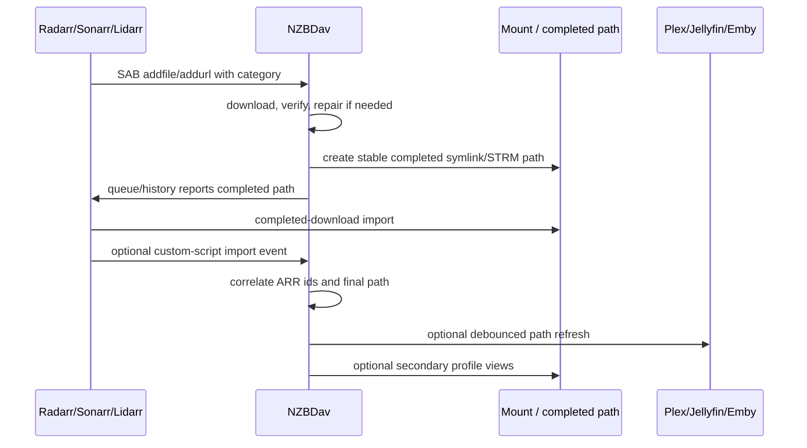

# ARR-Safe Media Organization Design

Last updated: 2026-07-04.

Superseded direction: the default roadmap should now follow
[arr-driven-download-prioritization.md](arr-driven-download-prioritization.md).
The prior organizer/template/profile ideas below are retained as research
notes only. They should not be implemented as default NZBDav behavior because
they still risk competing with ARR.

This design reviews the CineSync, Riven, and FileBot-inspired suggestions
through the Radarr/Sonarr/Lidarr integration boundary. NZBDav should enhance
ARR workflows by becoming a better SAB-compatible download client, virtual
storage layer, diagnostics surface, and optional secondary organizer. It should
not replace ARR search, grab, import, rename, upgrade, deletion, or media
management decisions.

## ARR Compatibility Rules

These rules are non-negotiable for the default production flow:

* ARR owns requests, search, grab selection, quality profiles, custom formats,
  upgrades, final rename/layout, and library deletion.
* NZBDav owns SAB-compatible download-client behavior, NNTP retrieval, adaptive
  download ordering for ARR-sent items, virtual completed-download paths,
  repair/verify/cache state, and mount readiness.
* Completed download folders and ARR library root folders must stay separate.
  NZBDav must never sort, move, or rename completed downloads into an ARR root
  folder.
* NZBDav must retain completed history long enough for ARR completed-download
  handling to see and import it. The SAB-compatible history should not disappear
  just because a symlink, mount, provider, or repair check is temporarily
  unavailable.
* Any new queue, history, status, fullstatus, or warning fields must be additive
  and keep SAB/ARR-compatible response shapes stable.
* NZBDav must never write directly to ARR databases.
* NZBDav may call ARR APIs only through documented API surfaces and only for
  bounded actions: queue lookup, metadata reads for already-queued items,
  refresh monitored downloads, health/diagnostic checks, and configured
  stuck-item cleanup.
* Mount degraded, repair pending, provider exhausted, or cache unavailable must
  delay completion exposure rather than let ARR import an empty or unstable
  path.

## Current Integration Points

NZBDav already has the core ARR path:

* SAB-compatible add/queue/history/status/fullstatus endpoints.
* Stable queue IDs and history IDs from `QueueItem` and `HistoryItem`.
* Completed symlink/STRM output surfaces.
* `ArrMonitoringService` that monitors configured Radarr/Sonarr/Lidarr queues
  and can remove/blocklist/search stuck items based on explicit rules.
* `ArrClient` wrappers for queue status, queue records, root folders, download
  clients, queue deletion, and `RefreshMonitoredDownloads`.
* Repair, verify, cache, provider, rclone, and mount diagnostics in status
  surfaces.

That means the CineSync/Riven/FileBot-inspired work should be reduced to ARR
metadata correlation and adaptive NZBDav queue ordering. It should not
introduce a parallel request manager, organizer, library profile manager, or
another download-client abstraction.

## Revised Implementation Direction

Implement ARR-driven download prioritization instead of media organization.
NZBDav should use ARR metadata to bump queued downloads that help ARR complete
useful library states sooner:

* recently aired Sonarr episodes;
* shows/seasons with few monitored episodes left;
* movies that complete Radarr collections;
* recently available Radarr movies;
* Lidarr albums or artists close to completion.

The detailed design is in
[arr-driven-download-prioritization.md](arr-driven-download-prioritization.md).

## Deferred Research Notes

The sections below are deferred research notes. They should not be implemented
until ARR-driven prioritization is stable and only if a future operator feature
clearly does not overlap with ARR ownership.

## Safe Feature Mapping

### Metadata Extraction

Safe default:

* Persist parser output and ARR-derived IDs as metadata beside queue/history/DAV
  items.
* Prefer ARR event/API metadata over external lookups when the item came from
  Radarr, Sonarr, or Lidarr.
* Use TMDb/TVDB/IMDb lookups only for manual NZBs or uncorrelated items.
* Never use NZBDav metadata to override ARR's movie/series/album match for an
  ARR-originated download.

Enhancement value:

* Better diagnostics for import failures.
* Better repair and broken-file reporting.
* Better UI display without requiring ARR users to open multiple apps.
* Safer secondary views such as Kids, Anime, 4K, HDR, and language filters.

Implementation:

* Add `MediaMetadata` with nullable ARR foreign identity fields:
  ARR app type, ARR instance id/name, movie id, series id, episode ids, artist
  id, album id, TMDb/TVDB/IMDb ids, release title, quality, custom formats,
  release group, language, media info, and parser confidence.
* Add `ArrDownloadCorrelation` keyed by NZBDav `nzo_id`/download id.
* Fill correlation from SAB add request data, ARR queue polling, and optional
  ARR custom-script events.

### Parser And Quality Detection

Safe default:

* Parser output is advisory unless the item is not associated with ARR.
* Parser confidence must be explicit: `ArrVerified`, `High`, `Medium`, `Low`,
  `Unknown`.
* Low-confidence parser results must never trigger rename, delete, blocklist, or
  search actions.

Enhancement value:

* Detect daily/date episodes, anime absolute numbering, multi-episode releases,
  localized terms, quality, codec, HDR, audio, remux/proper/repack, and edition.
* Explain why an item is not importable before ARR sees a broken path.

Implementation:

* Add parser tests from CineSync/Riven issue themes:
  localized titles, Spanish episode wording, anime absolute numbers, daily
  dates, multi-season packs, show/movie ambiguity, and releases with embedded
  IDs.
* Store parser results separately from ARR-derived final metadata.

### Template Naming

Safe default:

* ARR import mode must not use template naming for completed download paths.
  ARR should import from NZBDav's stable completed path and apply its own final
  naming in the ARR library.
* NZBDav templates may create secondary symlink/STRM views after ARR import or
  for manual/non-ARR items.

Enhancement value:

* Users can get CineSync/FileBot-style virtual views without breaking ARR
  imports.
* Plex/Jellyfin/Emby can consume alternate profile views without duplicating
  media bytes.

Implementation:

* Add `OrganizationProfile` with mode:
  `ArrImportSafe`, `SecondaryView`, `ManualOnly`.
* `ArrImportSafe` may only write the stable completed path that ARR expects.
* `SecondaryView` may write profile symlinks/STRM files pointing to the
  ARR-managed library path or NZBDav immutable item path.
* Add dry-run preview before any write:
  source path, target path, ARR owner, profile, conflicts, parser confidence,
  mount readiness, and whether ARR owns the destination.

### Virtual Library Profiles

Safe default:

* Profiles are derived views, not alternate ARR libraries unless the operator
  explicitly configures ARR roots that point to those views.
* Profiles must not move or delete ARR-managed files.

Enhancement value:

* Kids, Anime, 4K, HDR, language, rating, network, country, and tag-based
  views can be generated from ARR metadata and custom formats.
* Existing ARR tags and quality/custom-format data become useful in Plex/Jellyfin
  without creating a second request/search system.

Implementation:

* Store profile filter rules in NZBDav.
* Use ARR-provided metadata first, parser/external lookup second.
* Make overlap explicit in preview. If a file belongs in multiple profiles,
  create multiple symlinks/STRM files only after preview/apply.

### Media Server Refresh Hooks

Safe default:

* Disabled by default when ARR already has Plex/Jellyfin/Emby Connect hooks.
* Path-scoped refresh only, never full-library scans by default.
* Debounced and blocked when mount status is not ready.

Enhancement value:

* Helps setups where ARR imports symlinks but media-server refresh is unreliable
  because the mount or invalidation queue lags.
* Gives operators visible last-refresh status and errors.

Implementation:

* Add `MediaServerRefreshRun` records.
* Add per-server adapters for Plex/Jellyfin/Emby.
* Trigger only after:
  ARR import event, NZBDav repair completion, or completed symlink/STRM
  invalidation drain.
* Provide opt-in setting per ARR instance and per media server:
  `disabled`, `after-arr-import`, `after-nzbdav-repair`, `manual-only`.

### Custom Webhooks

Safe default:

* NZBDav can emit webhooks for operator automation.
* NZBDav can receive ARR custom-script events to improve correlation.
* Webhooks must be idempotent and must not run arbitrary shell commands inside
  NZBDav.

Enhancement value:

* ARR events provide authoritative metadata and import paths.
* Operators can integrate notifications, dashboards, and maintenance jobs
  without polling.

Implementation:

* Add `POST /api/arr/events/{radarr|sonarr|lidarr}` with token auth.
* Provide small sample ARR custom scripts that POST environment variables to
  NZBDav.
* Store raw event metadata in `ArrEventInbox` with hash-based idempotency.
* Process events asynchronously to avoid blocking ARR custom scripts.

### FileBot Adapter

Safe default:

* Disabled by default.
* External executable only; do not vendor or reimplement FileBot.
* Dry-run first and explicit operator apply required.
* Not allowed to mutate ARR-managed destination paths.

Enhancement value:

* Gives users FileBot-like naming/subtitle/artwork workflows for manual or
  secondary views while ARR remains source of truth for ARR-managed libraries.

Implementation:

* Add `Organizer:External:FileBotPath` and `Organizer:External:Mode`.
* Pass manifests through temp files, not shell-concatenated command strings.
* Capture stdout, stderr, exit code, file map, and warnings.
* Reject execution if the target path is an ARR root folder unless mode is
  `dry-run`.

### Repair And Failed Download Handling

Safe default:

* Provider errors and unknown segment states are retry/degraded states, not
  failed-download states.
* NZBDav should ask ARR to blocklist/search only when the item is definitively
  unrecoverable or an explicit configured stuck queue rule matches.
* Successful repair should refresh monitored downloads so ARR sees the now-ready
  item.

Enhancement value:

* ARR gets fewer bad imports and fewer manual-interaction loops.
* Operators can distinguish "provider temporarily failed" from "release is
  truly broken."

Implementation:

* Keep separate download, verify, and repair queues.
* Report repair state in SAB `status/fullstatus`.
* Completed history path becomes import-ready only after verification and mount
  invalidation readiness rules pass.
* Throttle `RefreshMonitoredDownloads` per ARR instance.

## ARR Event Strategy

Recommended event flow:

ARR custom-script ingestion should support these events first:

* Grab: capture ARR ids, release title, quality, release group, custom formats,
  category, download client, and download id.
* Import/Upgrade: capture final library path, source path, media info, deleted
  paths from upgrades, and ARR file IDs.
* Rename: update final library path correlation.
* File delete: mark secondary views stale and invalidate mount cache.
* Manual interaction required / health issue: surface actionable diagnostics in
  NZBDav without auto-removing anything unless configured queue rules match.

## API Additions

Additive APIs:

* `GET /api/arr/compatibility`
  * Shows ARR instances, completed-download handling readiness, root-folder
    conflicts, download-client path visibility, queue polling status, and last
    refresh command.
* `POST /api/arr/events/{app}`
  * Receives ARR custom-script event payloads.
* `GET /api/media-metadata/{itemId}`
  * Shows parsed and ARR-derived metadata with confidence.
* `POST /api/organizer/preview`
  * Produces a dry-run path map and safety report.
* `POST /api/organizer/apply`
  * Applies an already-created preview if all safety gates still pass.
* `GET /api/organizer/runs`
  * Shows history, failures, retries, exports, and clear status.

SAB-compatible APIs should remain stable. New fields go under additive
diagnostic containers, for example:

* `fullstatus.arr`
* `fullstatus.organizer`
* `fullstatus.media_servers`
* `fullstatus.virtual_libraries`

## Compatibility Checks

NZBDav should warn before enabling organization features when:

* the ARR root folder and NZBDav completed folder overlap;
* ARR cannot access the completed path NZBDav reports;
* mount status is not ready;
* rclone/DFS invalidation backlog is not draining;
* ARR has completed-download handling disabled;
* ARR reports download-client unavailable;
* history retention is too short for ARR import;
* NZBDav is configured to create a secondary view inside an ARR-managed root;
* FileBot execution mode would write to an ARR-owned path;
* media-server refresh is enabled in both ARR and NZBDav without debounce.

## Test Plan

Backend tests:

* ARR event ingestion idempotency.
* `ArrDownloadCorrelation` creation from Grab and Import events.
* Parser results never override ARR-verified metadata.
* Organizer preview blocks writes into ARR roots in ARR import mode.
* Secondary views generate symlinks/STRM files without moving ARR library files.
* FileBot adapter rejects shell-injection inputs and ARR-owned execution paths.
* Repair unknown/provider-error states do not trigger ARR blocklist/search.
* Definitive unrecoverable states can trigger configured queue cleanup rules.

Integration tests:

* Simulated Radarr flow:
  add NZB, queue, completed history, ARR import, custom import event, final path
  correlation, optional Plex refresh.
* Simulated Sonarr season-pack flow:
  multi-episode metadata, import complete event, secondary profile rendering.
* Simulated Lidarr flow:
  category preservation, album import event, no movie/show template leakage.
* Remote path mismatch:
  compatibility API reports a failure and organizer apply is blocked.
* Mount degraded:
  completed exposure and media-server refresh are blocked until readiness
  recovers.

Frontend tests:

* ARR compatibility panel.
* Organizer preview table with safety warnings.
* Event/run history with retry/export/clear.
* Settings defaults remain minimal; advanced organization settings stay collapsed
  and disabled until explicitly enabled.

## Implementation Order

1. Add ARR compatibility diagnostics and custom-script event ingestion.
2. Add metadata/correlation tables and parser tests.
3. Add dry-run organizer preview with ARR-root safety checks.
4. Add secondary view writer for symlink/STRM profiles.
5. Add media-server refresh adapters with debounce and readiness gates.
6. Add optional FileBot adapter in dry-run mode.
7. Add execution mode for FileBot only after path ownership checks and tests are
   complete.
