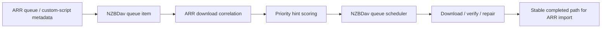
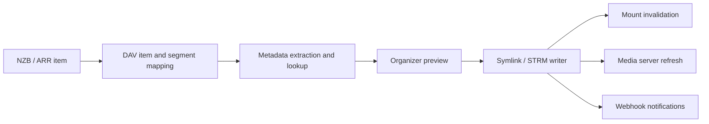

# CineSync, Riven, And FileBot Integration Research

Last updated: 2026-07-04.

This note records a live review of CineSync, Riven, FileBot, and their public
issue/PR signals. It is an implementation guide for NZBDav's fork, not a
proposal to copy every feature. NZBDav should remain a direct Usenet,
SAB-compatible ARR client and WebDAV/mount backend for Plex/Jellyfin/Emby.

Current implementation direction is now
[arr-driven-download-prioritization.md](arr-driven-download-prioritization.md).
ARR safety details for deferred organization ideas are retained in
[arr-safe-media-organization-design.md](arr-safe-media-organization-design.md).

## Sources Reviewed

* CineSync repository and release notes:
  <https://github.com/sureshfizzy/CineSync>
* CineSync issues and pull requests scraped through GitHub CLI:
  99 issues, 77 PRs.
* Riven repository and documentation:
  <https://github.com/rivenmedia/riven>,
  <https://dumbarr.com/services/core/riven-backend/>,
  <https://riven.tv/docs/troubleshooting>
* Riven issues and pull requests scraped through GitHub CLI:
  300 issues, 300 PRs.
* FileBot CLI, naming, and AMC documentation:
  <https://www.filebot.net/cli.html>,
  <https://www.filebot.net/naming.html>,
  <https://www.filebot.net/amc.html>

## What These Projects Do Well

### CineSync

CineSync's strongest ideas are not its debrid-specific plumbing. They are the
media organization pipeline around a virtual library:

* metadata-backed Movies/TV organization using TMDb, IMDb, and TVDB;
* symlink-oriented output layouts for Plex, Jellyfin, and Emby;
* category separation for Kids, 4K, Anime, and similar library profiles;
* realtime monitoring, web UI operations, failed-file export, retry, and clear
  flows;
* event-driven repair and retry handling instead of blind full rescans;
* mount startup hardening when source mounts are missing;
* custom webhook hooks after media import.

Open CineSync issue themes that map to NZBDav:

* reprocessing all files on restart can overload Plex and mounts;
* users want dynamic rclone/mount support, but this must fail closed;
* parsing still struggles with localized episode words, anime, and daily/date
  formats;
* users want custom webhooks after import;
* users want WebDAV/native-library serving in addition to symlink layouts;
* database rows should not disappear just because a file is temporarily absent.

### Riven

Riven is broader than NZBDav should become. Its useful ideas are its pipeline
model, VFS naming, library profiles, and operational lessons:

* request/list ingestion, scraping, ranking, download, VFS, rename/link, and
  media-server update are separate pipeline stages;
* library profiles expose virtual paths filtered by metadata such as media type,
  genre, year, rating, anime flag, network, country, language, and content
  rating;
* VFS templates include title, year, IMDb/TMDb/TVDB ids, resolution, codec,
  HDR, audio, quality, container, remux/proper/repack, and edition fields;
* Riven deployment docs repeatedly stress mount propagation, `/dev/fuse`,
  `allow_other`, and restart behavior because empty or stale mounts cause media
  servers to scan the wrong state;
* issue themes include pipeline stalls, memory leaks/OOM during large imports,
  executor backpressure, duplicate event keys, bad timestamps, queue sequencing,
  date-based episode matching, localization, and show/movie misclassification.

Riven features NZBDav should not copy directly:

* torrent/debrid scraping and ranking as a primary downloader;
* qBittorrent emulation;
* always-on request/list ingestion as a replacement for Sonarr/Radarr;
* a second permanent mount backend alongside the chosen NZBDav mount path.

### FileBot

FileBot is the best reference for naming semantics and dry-run safety:

* rich naming expressions with built-in Plex, Kodi, Emby, and Jellyfin formats;
* bindings for series/movie ids, title, year, season, episode, collections,
  languages, genres, certification, codec, container, resolution, HDR, audio,
  original names, and release metadata;
* dry-run mode, conflict policies, exclude lists, file age/size filters, and
  skip-symlink protections;
* optional archive extraction, subtitle/artwork/NFO creation, and media-server
  refresh hooks.

FileBot is commercial software. NZBDav should not vendor FileBot code or rely on
its binary by default. If support is useful, add an optional external command
adapter that calls a user-installed FileBot executable in dry-run or execute
mode.

## Current NZBDav Gap Analysis

The default gap is not media organization. The default gap is ARR-aware download
ordering: NZBDav should use ARR metadata to choose which already-queued
downloads run first while ARR keeps control of library planning, naming,
imports, upgrades, collections, and deletes.

Already present or in progress in this fork:

* direct NNTP streaming, SAB-compatible ARR endpoints, queue/history/status,
  active streams, provider pools, repair/cache/mount diagnostics;
* symlink and STRM import output modes;
* durable download, verify, and repair queues;
* rclone invalidation outbox and DFS prototype behind a benchmark gate;
* sparse segment cache and random-access streaming improvements;
* queue sorting, filtering, page size, pause/resume, and health panels.

Deferred compared with CineSync/Riven/FileBot:

* persisted media metadata attached to DAV items and queue/history records;
* metadata provider abstraction for TMDb/TVDB/IMDb lookup and caching;
* safe filename parser for title/year/season/episode/multi-episode/date/anime
  patterns and release quality fields;
* template-driven naming/layout engine with Plex/Jellyfin/Emby presets;
* dry-run organizer preview API and web UI before writing symlinks or STRM
  files;
* virtual library profiles such as Kids, Anime, 4K, HDR, language, rating, and
  content-rating filtered paths;
* path-scoped Plex/Jellyfin/Emby refresh hooks with throttling;
* custom webhook notifications after import, delete, repair, and broken-file
  detection;
* organizer job history, retry/export/clear flows, and visible failure reasons;
* optional FileBot command adapter.

## Recommended Default Architecture

The implementation path should be ARR-driven prioritization, not an organizer:



Only the research ideas below are retained for possible future operator tools.

## Deferred Organization Architecture

Add a media organization layer above DAV items, not inside the stream reader or
NNTP provider path.



Core interfaces:

```csharp
public interface IMediaMetadataProvider
{
    ValueTask<MediaMetadataMatch?> MatchAsync(MediaMetadataQuery query, CancellationToken ct);
}

public interface IMediaNameTemplateRenderer
{
    MediaPathRenderResult Render(MediaNameTemplate template, MediaMetadata metadata);
}

public interface IMediaOrganizationService
{
    ValueTask<OrganizationPreview> PreviewAsync(Guid itemId, OrganizationProfile profile, CancellationToken ct);
    ValueTask<OrganizationRun> ApplyAsync(Guid previewId, CancellationToken ct);
}

public interface IMediaServerUpdater
{
    ValueTask<MediaServerUpdateResult> RefreshPathAsync(string path, CancellationToken ct);
}
```

Persisted tables:

* `MediaMetadata` keyed by DAV item or queue history id;
* `MediaOrganizationProfiles` for layout, filters, conflict policy, and output
  mode;
* `MediaOrganizationRuns` and `MediaOrganizationFailures` for audit, retry,
  export, and clear;
* `MediaServerRefreshRuns` for Plex/Jellyfin/Emby refresh status;
* optional `ExternalOrganizerRuns` for FileBot adapter dry-run/execute logs.

## Implementation Plan

### Phase 1 - Metadata And Parser Foundation

* Add `MediaMetadata` model and migration.
* Add local filename/NZB parser that extracts:
  title, year, season, episode, multi-episode spans, date-based episodes,
  language, anime absolute episode, resolution, source, codec, HDR, audio,
  release group, remux/proper/repack, and edition.
* Add parser tests from real issue themes:
  localized titles, Spanish episode words, date episodes, anime, multi-season
  packs, duplicate movie/show names, and releases with IDs in names.
* Make parser output visible in diagnostics but do not change library paths yet.

### Phase 2 - Template Naming And Dry Run

* Add a limited, safe template renderer. Avoid executing arbitrary code.
* Built-in presets:
  `current`, `plex`, `jellyfin`, `emby`, `anime`, `kids`, `4k`, and `filebot-like`.
* Add conflict policies:
  `skip`, `replace`, `rename`, `side-by-side`, `fail`.
* Add `POST /api/organizer/preview` and `POST /api/organizer/apply`.
* Add a WebUI preview table showing source item, rendered target path,
  detected metadata, conflicts, and warnings.

### Phase 3 - Profiles And Virtual Libraries

* Add organization profiles with filters for media type, genre, anime, 4K/HDR,
  language, rating, content rating, network, country, year range, and tags.
* Generate profile-specific symlink/STRM trees without duplicating media bytes.
* Keep profile matching deterministic and auditable. If profiles overlap, expose
  the selected output paths in preview before apply.

### Phase 4 - Media Server And Webhook Hooks

* Add path-scoped Plex, Jellyfin, and Emby refresh adapters.
* Debounce refreshes and skip them when mount readiness is degraded, provider
  pools are exhausted, or active streams are under heavy load.
* Add custom webhooks for:
  import complete, import failed, repair started, repair completed, broken file,
  mount degraded, and provider degraded.

### Phase 5 - Optional FileBot Adapter

* Add disabled-by-default external command support:
  `Organizer:External:FileBotPath`, `Organizer:External:Mode=dry-run|execute`.
* Pass a temp manifest to FileBot instead of constructing shell strings.
* Capture stdout/stderr, exit code, generated path map, and warnings.
* Require explicit docs that users supply their own FileBot license and app
  data. NZBDav should not bundle FileBot.

## Product Guardrails

* Keep ARR as the primary request/search/orchestration system.
* Keep ARR as the owner of final imports, library paths, naming, upgrades,
  quality profiles, custom formats, and delete decisions for ARR-originated
  downloads.
* Keep torrent/debrid/qBittorrent features out of this fork unless the user
  explicitly changes the project scope.
* Do not add large WebUI settings pages for every parser knob. Prefer profiles,
  presets, dry-run previews, and diagnostics.
* Do not let organizer jobs mutate library paths while mount status is degraded.
* Do not delete metadata rows just because source files disappear temporarily.
* Do not trigger full Plex scans for every change; refresh the narrowest path
  possible and rate-limit updates.

## Highest-Value Next Tasks

1. Implement ARR download correlation and priority hint storage.
2. Add report-only ARR prioritization status APIs and UI.
3. Add Sonarr scoring for recently aired, season-completing, and
   series-completing downloads.
4. Add Radarr scoring for collection-completing and recently available movies.
5. Enable apply mode only after report-only behavior is verified.
