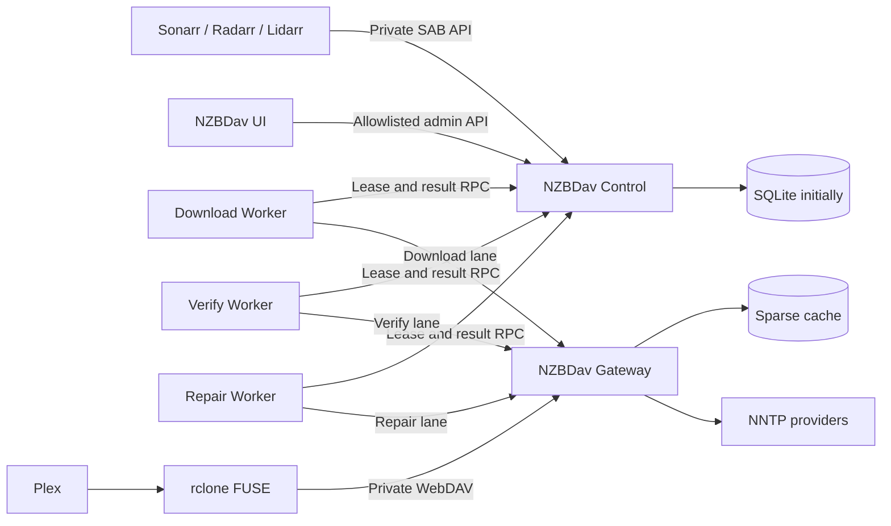

# NZBDav Single-Host Role Separation Design

**Status:** Approved

**Date:** 2026-07-11

## Summary

NZBDav will move from one backend process that owns WebDAV, SAB/ARR APIs,
downloads, verification, repair, maintenance, provider pools, cache, and mount
integration into multiple role-specific containers on the current single
server. The split isolates latency-sensitive playback from background work
without creating multiple provider pools, multiple cache writers, or multiple
database writers.

Rclone remains the supported production mount. Native FUSE remains a future
replacement candidate and must use the same gateway data plane if it is
benchmarked again.

The design deliberately avoids a conventional distributed microservice stack.
It uses one image, one host, one control-plane database owner, one NNTP/cache
gateway, role-specific workers, and private Docker networking. It does not add
Redis, a general-purpose message broker, distributed cache coordination, or new
operator tuning controls.

## Context

The current backend registers all major responsibilities in one process in
`backend/Program.cs`. Consequently, queue processing, provider operations,
verification, repair, cleanup, WebDAV serving, mount status, websocket updates,
and ARR monitoring share one .NET thread pool, one GC domain, and one failure
boundary.

Production evidence showed that NZBDav already uses more than one CPU core.
The problem is therefore not simply a missing multithreading switch. The
important problems are contention, large background fan-out, weak
backpressure, fixed non-renewed leases, process-wide cache ownership, and
forced full garbage collection under pressure.

The existing implementation provides useful foundations:

- `WorkerJobs` already separates download, verify, and repair work.
- `INntpClient` is an existing provider abstraction.
- `IFileRangeReader` is an existing random-access abstraction.
- `SparseSegmentCacheManager` already supplies local sparse range caching.
- SQLite and PostgreSQL providers already exist.
- SAB-compatible queue/history/status behavior and ARR correlation already
  exist.

The redesign extends these boundaries instead of rewriting the entire product.

## Goals

- Keep playback and WebDAV responsive while download, verify, or repair queues
  are saturated.
- Allow each background lane to restart, scale, and collect garbage without
  stopping playback or the other lanes.
- Own every configured NNTP connection in exactly one process.
- Own every sparse cache file in exactly one process.
- Preserve provider caps across all roles.
- Keep SQLite viable initially by allowing only the control role to access it.
- Make worker leases renewable, owner-checked, cancellable, and idempotent.
- Keep existing mounted files readable during a temporary control-plane
  outage.
- Keep ARR imports safe across container and host restarts.
- Keep SAB and WebDAV off the public internet.
- Preserve the rclone configuration and mount URL during production cutover.
- Improve multicore use for bounded CPU work while avoiding thread and memory
  oversubscription.
- Reject the redesign if aggregate CPU, memory, or playback latency becomes
  materially worse.

## Non-Goals

- Multi-host workers.
- Multiple control replicas.
- Redis or a general message broker.
- A permanent second filesystem backend.
- Promoting the existing DFS prototype.
- Replacing ARR naming, importing, quality, collection, or library ownership.
- Moving the local media library onto WebDAV or FUSE.
- Making the SAB endpoint internet-accessible.
- Adding provider-scheduler, GC, or circuit-breaker tuning to the WebUI.
- Requiring PostgreSQL before the role split can operate.

## Chosen Topology

All application roles are built from the same repository and image. The
runtime role is selected by an explicit command or `NZBDAV_ROLE` value.

Supported roles:

- `all`: transitional all-in-one runtime used for migration and rollback.
- `control`: database owner, SAB/ARR API, job coordination, configuration,
  lifecycle, and status aggregation.
- `gateway`: WebDAV, NNTP provider pools, provider scheduling, sparse cache,
  immutable manifest mirror, and range serving.
- `worker-download`: download queue execution and metadata processing.
- `worker-verify`: segment verification only.
- `worker-repair`: repair planning and durable ARR repair command execution.
- `ui`: React/Node frontend and allowlisted admin API proxy.

Rclone remains its own container.



## Network And Exposure Policy

The deployment adds a private `nzbdav-internal` Docker network.

- `ui` joins `proxy` and `nzbdav-internal`.
- `control`, `gateway`, and all workers join only `nzbdav-internal`.
- rclone joins `nzbdav-internal` and retains the host mount propagation it
  already requires.
- ARR containers join `nzbdav-internal` for SAB access.
- No control, gateway, worker, or rclone port is published to the host.
- Traefik routes only to `ui`.
- SAB has no Traefik router.
- WebDAV has no Traefik router.

The SAB endpoint is reachable only from the trusted Docker network. A future
VPN-specific route would require an explicit deployment change and is not part
of the default topology.

The UI proxy uses an explicit endpoint and method allowlist. It no longer
forwards every `/api`, WebDAV, `/content`, `/nzbs`, or `/completed-symlinks`
request from its public listener.

Internal RPC uses HTTP/2 gRPC over `nzbdav-internal`. Every call carries an
internal service token delivered as a Docker secret. TLS is not required on the
single-host private bridge, but the token prevents an unrelated container on a
shared network from impersonating an NZBDav role.

## Control Role

Control is the only role that opens the application database. This preserves a
single SQLite writer and avoids unsafe shared SQLite access from workers.

Control owns:

- SAB-compatible API behavior.
- ARR correlation, priorities, search nudges, and lifecycle reporting.
- Queue and history state.
- Worker job leases and cancellation.
- Configuration and secret redaction.
- Repair run state and durable ARR command outbox.
- Rclone invalidation outbox.
- Manifest change outbox.
- Import receipts.
- Aggregated health and status responses.

Workers and gateway never receive a database path or connection string.
PostgreSQL remains supported, but it is not required for this single-host
topology.

## Worker Lease Contract

The existing `WorkerJob` model gains:

- `LeaseToken`: an opaque random token for the current lease.
- `LeaseGeneration`: a monotonically increasing integer.
- `LastHeartbeatAt`: the latest accepted renewal.
- `StartedAt`: the first execution start for the current attempt.
- `CancelRequestedAt`: a durable cancellation request.
- `FailureKind`: a normalized retry, provider, data, cancellation, or permanent
  failure classification.

The internal job coordinator exposes:

```text
LeaseJob(kind, workerId, capacity)
RenewLease(jobId, leaseToken, generation)
ReportProgress(jobId, leaseToken, generation, progress)
CompleteJob(jobId, leaseToken, generation, result)
FailJob(jobId, leaseToken, generation, failureKind, retryAfter, error)
ReleaseJob(jobId, leaseToken, generation)
```

Initial internal lease timing is two minutes with renewal every 30 seconds.
These are code-level safety defaults, not WebUI controls.

Every mutation is a compare-and-swap operation matching:

```text
Id + Status=Leased + LeaseToken + LeaseGeneration + LeaseOwner
```

If no row is updated, the lease is no longer valid and the worker must discard
its result. A stale worker cannot complete a cancelled job, replace a newer
lease, or overwrite a quarantined result.

Workers cancel their local operation when renewal is rejected. If control is
unreachable, a worker may continue only until the locally known lease expiry;
it then cancels and does not publish a result.

Completion is idempotent for the same lease generation. Queue transition,
history transition, follow-up job creation, lifecycle event creation, and
outbox creation commit in one control transaction.

## Gateway Data Plane

Gateway is the only owner of:

- Provider credentials in active memory.
- NNTP provider clients and connection pools.
- Circuit breakers and provider fallback state.
- Global connection scheduling.
- Sparse range cache files.
- In-flight article and range-fetch deduplication.
- Provider and cache diagnostics.
- WebDAV request handling.

Gateway exposes these private RPC operations:

```text
StatSegments
ReadYencHeader
ReadDecodedArticle
ReadFileRange
GetProviderStatus
GetCacheStatus
WatchConfiguration
WatchManifestChanges
ClaimCompletedImport
```

`ReadDecodedArticle` and `ReadFileRange` stream bounded byte frames and honor
caller cancellation and deadlines. They do not buffer a complete article or
file range in one managed object.

A `RemoteNntpClient` adapts gateway RPC to the existing `INntpClient`
interface. This allows queue and verification code to migrate incrementally.
Connection-affinity APIs become gateway scheduling hints; workers do not hold a
raw provider connection across RPC boundaries.

A future native FUSE sidecar would call `ReadFileRange` and manifest RPCs
directly. It would not create another provider pool or cache implementation.

## Provider Scheduling

Every gateway request identifies one lane:

- `stream`
- `download`
- `verify`
- `repair`

The scheduler applies each provider's configured maximum exactly once. Workers
have no direct NNTP connections.

Scheduling uses deterministic weighted fairness with aging:

- Foreground stream requests receive the shortest queueing path.
- Already running NNTP commands are not forcefully preempted.
- Background STAT batches remain bounded so they cannot hold many connections
  for long periods.
- Download, verify, and repair lanes retain progress under sustained playback.
- A waiting request gains effective priority with age to prevent starvation.
- Reachable backup providers can satisfy foreground reads without waiting for
  every primary to recover.

Existing provider caps, lane maximums, and adaptive-connection enablement remain
the operator inputs. No new provider scheduler settings are added to the UI.

## Configuration And Pool Reload

Control owns persisted configuration and produces a canonical, versioned
gateway configuration snapshot. The snapshot hash includes values that affect
provider pools, cache behavior, or WebDAV semantics.

- An unchanged hash is a no-op.
- A changed provider snapshot builds a replacement pool.
- The replacement pool must pass configuration and connection probes.
- Gateway atomically swaps to the new pool only after it is ready.
- The old pool drains active operations before disposal.
- Failed replacement leaves the active pool unchanged and reports the error.

Control atomically writes the last accepted gateway snapshot beneath the
protected config runtime directory. Gateway can restart from that snapshot
during a temporary control outage.

Rclone configuration is independent from provider configuration. Provider or
worker changes never recreate rclone.

## Manifest Mirror And Read Availability

Control remains the source of truth for the logical DAV tree. Every committed
tree change receives a monotonically increasing manifest sequence and a durable
outbox record.

Gateway maintains a local read-only manifest mirror and records its last
acknowledged sequence. On reconnect, it requests changes after that sequence.
If a gap cannot be replayed, it downloads a complete snapshot and atomically
replaces the local mirror.

During a control outage:

- Existing manifest entries remain listable and readable.
- Existing files can still fetch uncached articles through the gateway's last
  accepted provider configuration.
- Namespace mutations and completed-import claims return `503`.
- Gateway never returns an empty replacement root because control is down.

During a gateway outage, rclone may expose its existing cached directory state,
but file reads fail. It must not replace the mount with an empty local
directory. Gateway recovery does not require rclone recreation.

## Worker Roles

Each worker role runs in a separate process and GC domain.

### Download Worker

- Leases only `Download` jobs.
- Receives the NZB input and immutable processing configuration from control.
- Uses `RemoteNntpClient` for provider operations.
- Produces a deterministic processed manifest artifact.
- Does not write queue, history, DAV, or lifecycle tables.

### Verify Worker

- Leases only `Verify` jobs.
- Receives the immutable target manifest and recent-check hints.
- Uses gateway batch STAT operations.
- Returns `Exists`, `Missing`, `ProviderError`, and `Unknown` results.
- Never requests repair for unknown or provider-error outcomes.

### Repair Worker

- Leases only `Repair` jobs.
- Produces a repair plan from durable verification state.
- Uses a durable ARR command outbox for remove-and-search operations.
- Does not delete DAV content before the ARR command state is committed.
- Reconciles an accepted ARR command before retrying after an ambiguous crash.

Existing maximum download, verify, and repair counts remain separate and
independent. No lane may borrow unbounded work from another lane.

## Temporary Artifact Exchange

Large processed-download results do not travel as one in-memory gRPC message.
Workers and control share a temporary exchange volume under `/cache/exchange`.

Artifact protocol:

1. Worker writes a MemoryPack artifact to a lease-token-scoped temporary path.
2. Worker flushes the file and atomically renames it to `.ready`.
3. Worker reports the relative path, byte length, SHA-256, job ID, token, and
   generation.
4. Control validates path containment, ownership metadata, size, and hash.
5. Control streams the artifact into its transaction without loading it all
   into managed memory.
6. Successful commit enqueues artifact deletion.
7. Startup and periodic cleanup remove expired temporary artifacts that do not
   belong to a current lease.

The exchange is size-bounded, disposable, excluded from backup and database
migration, and never used as permanent media storage.

## ARR Import Semantics

The completed-download source remains separate from the local media library.
NZBDav does not move the library onto FUSE and does not require a same-mount
atomic rename.

Sonarr and Radarr preserve symbolic links when copying or moving them on Linux.
The cross-filesystem operation therefore creates the lightweight destination
link and removes the source link; it does not copy the referenced media body.

The current 30-second process-local deleted-file cache is replaced with a
durable `ImportReceipt` keyed by completed item and history item.

States:

- `Available`
- `UnlinkClaimed`
- `Imported`
- `Removed`
- `NeedsReview`

When rclone issues DELETE for a completed symlink, gateway calls control before
returning success. Control transactionally changes `Available` to
`UnlinkClaimed` and emits manifest and rclone invalidation outbox records.
Repeated DELETE calls are idempotent.

ARR import events or a verified organized-library link transition the receipt
to `Imported`. SAB history removal transitions it to `Removed` and schedules
safe cleanup. An ambiguous claim is never automatically made visible again;
reconciliation either confirms the destination or marks `NeedsReview`. This
prefers a visible operator condition over a duplicate import loop.

## Memory, GC, And Multicore Policy

Process separation is not a substitute for bounded memory behavior.

- Remove forced blocking and compacting `GC.Collect` calls from normal queue
  completion.
- Keep .NET 10 dynamic GC adaptation enabled.
- Record `GCSettings.IsServerGC` and benchmark GC mode per role.
- Do not enable the same heap count or hard limit for every role.
- Treat container memory limits as crash containment, not the performance fix.
- Use bounded `Channel<T>` instances with producer backpressure.
- Configure bounded `PipeOptions` in the UsenetSharp article path.
- Use pooled buffers and return them promptly.
- Stream article and artifact data directly to destination buffers or sparse
  files.
- Avoid retaining full article bodies, complete file ranges, or complete result
  artifacts in managed memory.
- Bound every per-job parallel loop.
- Use asynchronous I/O rather than `Task.Run` for network and disk operations.
- Run CPU-heavy parsing, parity, hashing, and archive work with bounded
  parallelism in worker processes.
- Treat verification as I/O-bound and improve it through batching and provider
  scheduling, not more unmanaged threads.

The control role remains small and allocation-light. Gateway is optimized for
latency and cancellation. Workers are optimized for bounded throughput.

## Health And Failure Semantics

Every role exposes separate liveness and readiness checks.

### Worker Failure

- Gateway and active playback remain unaffected.
- The lease expires or is released.
- A replacement worker receives a new generation.
- Late results from the old generation are rejected.

### Control Failure

- Gateway continues read-only service from its manifest and provider snapshots.
- Workers stop after lease expiry because they cannot renew.
- SAB and admin mutations are unavailable.
- Completed-import claims fail closed.

### Gateway Failure

- Control remains available and reports gateway degradation.
- New worker leases pause before provider work begins.
- Rclone receives WebDAV failures but is not recreated solely because gateway
  restarted.
- The mount heartbeat must not expose an empty replacement directory.

### Rclone Failure

- Control, gateway, and workers remain running.
- Existing recovery logic pauses media consumers, repairs the mount, verifies
  it, and resumes consumers.
- Rclone is recreated only when the mount is unhealthy or rclone's own
  configuration changed.

### Database Failure

- Control readiness fails and stops lease issuance.
- Gateway remains read-only from its last accepted manifest.
- No worker result is treated as committed until control confirms it.

### Provider Failure

- Gateway classifies missing articles separately from provider errors.
- Missing articles do not trip provider circuits.
- Unknown/provider errors remain retryable.
- Definitive missing-on-all-provider results may produce repair work.

## Status And Observability

Control aggregates role snapshots into SAB `status/fullstatus` and the
operations UI.

Per role:

- Process ID and role instance ID.
- Readiness and last heartbeat.
- CPU cores consumed.
- RSS and proportional set size when available.
- Managed heap size and allocation rate.
- Gen0, Gen1, and Gen2 collection counts.
- GC pause duration percentiles.
- Thread-pool thread and pending-item counts.
- Active and queued RPCs.

Gateway:

- Provider connections, configured caps, queue wait, command latency, errors,
  fallback, and circuit state.
- Cache bytes, range hits/misses, pending fetches, evictions, first-byte
  latency, and provider fetch errors.
- Scheduler wait and grants by lane.
- Manifest sequence and control lag.

Workers:

- Active jobs and configured maximum.
- Lease renewals, rejected renewals, retries, and quarantines.
- Queue wait, processing time, artifact size, and failure class.

No secret appears in status or logs. Query-string API keys are redacted before
request logging.

## Migration And Rollout

The deployment changes in reversible phases.

### Phase 0: Baseline

- Fix benchmark-harness argument and test failures.
- Capture current idle, playback, seek, concurrent playback, download, verify,
  repair, CPU, PSS, GC, provider, and cache evidence.

### Phase 1: Role-Aware Host

- Extract role-specific service registration.
- Keep `all` as production default.
- Add role startup and ownership tests.

### Phase 2: Durable Coordination

- Add lease tokens, generations, renewal, cancellation, import receipts, and
  outboxes while still running all-in-one.
- Verify crash and stale-worker behavior before process extraction.

### Phase 3: Gateway Extraction

- Add the in-process article gateway contract.
- Add gRPC and `RemoteNntpClient` parity tests.
- Run the all-in-one control/workers against the external gateway.
- Move provider secrets and sparse cache ownership to gateway.

### Phase 4: Worker Extraction

- Extract verify first.
- Extract download second.
- Extract repair last.
- Validate each lane in production before enabling the next.

### Phase 5: External Surface Split

- Run the UI separately.
- Put SAB and WebDAV on the private network only.
- Apply the UI proxy allowlist.
- Keep stable internal service aliases.

### Phase 6: Production Default

- Make role-separated Compose the production default.
- Keep `all` available for one release cycle.
- Remove transitional paths only after the rollback window and benchmark gates
  pass.

The gateway receives the Docker network alias `nzbdav` used by the existing
rclone URL. Rclone configuration therefore remains unchanged at cutover. ARR
uses a stable `nzbdav-sab` alias for control.

## Rollback

All schema migrations are additive. The updated `all` role understands every
new table and column.

Rollback procedure:

1. Stop issuing new worker leases.
2. Wait for active leases to complete or expire.
3. Stop role-specific workers.
4. Drain the gateway provider pool.
5. Start the updated `all` role with the `nzbdav` and `nzbdav-sab` aliases.
6. Confirm SAB, WebDAV, provider, cache, and mount health.
7. Stop the separated control/gateway services.

Rollback does not downgrade the database and does not rewrite rclone
configuration.

## Verification And Release Gates

### Correctness

- Role registration tests prove each role starts only owned services.
- In-process and gRPC article-gateway implementations pass the same contract
  suite.
- Lease tests cover renewal, expiry, cancellation, stale completion,
  idempotent completion, retry, and quarantine.
- Manifest tests cover replay, snapshot replacement, control outage, and gap
  recovery.
- Import tests cover successful copy-plus-unlink, repeated unlink, control
  restart, ARR event confirmation, SAB history removal, and ambiguous outcomes.
- Provider tests prove aggregate connections never exceed configured caps.
- Cache tests prove single-writer ownership and no permanent artifact storage.
- Compose tests prove SAB and WebDAV are not published or Traefik-routed.
- SQLite and PostgreSQL migration smoke tests pass.
- Each role has a container startup smoke test.

### Failure Isolation

- Killing any worker does not interrupt an active WebDAV/rclone playback read.
- Saturating verify and repair does not consume all stream capacity.
- Killing control leaves existing gateway reads available and rejects
  mutations.
- Killing gateway never produces an empty replacement mount.
- Restarting gateway does not recreate rclone.
- Reapplying an unchanged provider configuration does not recreate provider
  pools.

### Performance

- Idle direct-WebDAV p95 first-byte and seek latency regress by no more than
  5%.
- Under saturated verify and repair, gateway p95 increases by no more than 10%
  relative to candidate idle performance.
- Contended first-byte latency improves at least 20% over the captured monolith
  baseline.
- Four-file parallel direct and FUSE wall times improve materially from the
  recorded 11.46-second and 18.67-second results.
- Aggregate NZBDav CPU across all roles is no more than 10% above the monolith
  under the same workload.
- Aggregate proportional set size is no more than 10% above the monolith.
- Normal operation performs no forced blocking Gen2 collection.
- Gateway GC p99 pause does not regress from baseline.
- Worker processes open zero NNTP connections directly.

Missing evidence is a failed gate. Performance failures are fixed in code or
architecture; they are not accepted by adding lower WebUI limits.

## CI And Release Changes

CI retains all existing backend, frontend, Playwright, Docker, vulnerability,
migration, and whitespace gates. It adds:

- Role-specific build and startup tests.
- gRPC contract and cancellation tests.
- Multi-container Compose smoke tests.
- Crash/restart and stale-lease tests.
- Private-network exposure assertions.
- Import receipt and manifest-replay integration tests.
- Benchmark artifact schema validation.

GHCR still publishes `beta`, `latest`, and immutable SHA tags from one image.
The same image runs every role.

## Native FUSE Decision

Rclone remains production default throughout this implementation. The existing
DFS prototype is not promoted.

After the gateway and role split pass production gates, a new native FUSE
sidecar may be evaluated. It must use gateway manifest and `ReadFileRange` RPCs,
must not own provider connections or cache files, and must replace rclone only
after the existing same-host filesystem benchmark proves at least 20% better
p95 seek latency with no more than 10% CPU/PSS regression and complete
correctness/fail-closed behavior.

## Final Decisions

- Deployment target: multiple containers on the current single server.
- Public SAB: no.
- Public WebDAV: no.
- Database owner: control only.
- Initial database: SQLite remains acceptable.
- Provider/cache owner: gateway only.
- Worker isolation: one process per lane.
- ARR import: separate mounts with durable copy-plus-unlink semantics.
- Production mount: rclone.
- Native FUSE: deferred benchmark candidate.
- New WebUI tuning settings: none.
